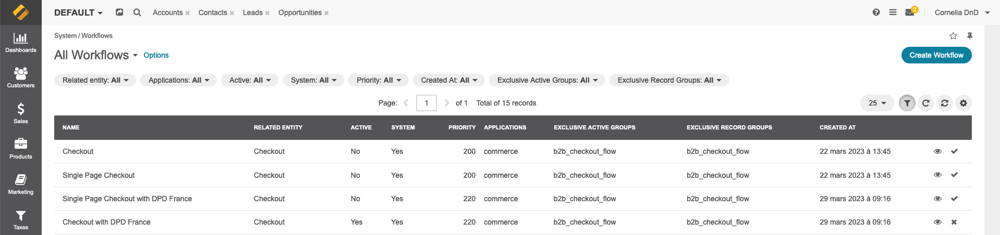

# Agence Dn'D - DPD France Shipping Bundle:

### Documentation:

After installing `DPD France Shipping Bundle`, please follow these steps:

#### Create the DPD France Shipping Integration

In the admin section, go to `System > Integrations > Manage integrations > Create Integration`.

Select the `DPD France` integration type and fill in the requested configurations.


#### Configure the DPD France Shipping Integration

The configuration fields available in the Integration are: 
* Type
* Name
* Agency code
* Contract number
* Max quantity
* Shipping Services
* DPD Classic service label
* DPD Classic service description
* DPD Predict service label
* DPD Predict service description
* DPD Relay service label
* DPD Relay service description
* Google Maps API key
* Enable station export
* Station FTP Host
* Station FTP User
* Station FTP Password
* Station FTP Port
* Order statuses sent to station
* Default owner


#### Create the shipping rules associated to DPD Shipping method

In the admin section, go to `System > Shipping rules > Create shipping rule`.

Select the proper currency / website combination for your store, set a base price for the services and an eventual extra fee per service in the additional options section.

In order to use the quantity limitation for DPD shipping at product level, you have to set the following rule expression:
```
lineItems.all(
    (lineItem.product.maxQtyForDpdFr < 0)
    or
    (lineItem.product.maxQtyForDpdFr >= lineItem.quantity)
)
```

* A product with the attribute `DPD France Max qty` set to "-1" has no specific quantity limitation
* A product with the attribute `DPD France Max qty` set to "0" is not shippable with DPD France

There are 3 levels of limitation regarding product quantities:
* 1- The DPD France `Maximum package number per order` Integration global setting
* 2- The DPD shipping method specific limitation inside the database table `dnd_dpd_fr_shipping_service`: `parcel_max_amount`
* 3- The Product specific limitation with the attribute `DPD France Max qty` as described above

Other limitations can be set using [Expression Language for Shipping and Payment Rules](https://doc.oroinc.com/user/back-office/system/shipping-rules/expression-lang/#payment-shipping-expression-lang).
For example, you can add the following expression on top of your expression rules to limit the DPD shipping method to a specific customer group:

```
customer.group.id = 4 and 
lineItems.all(...)
```


#### Enable the specific checkout workflow "With DPD France"

The two native checkout workflows have been cloned into their corresponding "*...with DPD France*" workflows.

Enable the one corresponding to the workflow desired:



#### Product weight

As the product weight and size are used in package calculation, products must have their "Shipping options" configured properly in order to allow DPD shipping method usage.

Please make sure to use kilogram (kg) and centimeter (cm) units to ensure the correct calculation.


#### Export to DPD Station

If you choose to, you can automatically export your order shipments to DPD Station using the DPD Station configurations from the integration.

Exported files will be sent to DPD Station through the FTP accesses configured in the DPD integration and the files will also be stored locally under the `data/dpd-france/export` directory.

#### Customize DPD shipping methods limitations

DPD shipping standard limitations are stored inside the database table `dnd_dpd_fr_shipping_service` and can be adjusted in the case of specific contractual agreements with DPD France:
* Weight limitation is expressed in kilograms (kg)
* Dimensions limitations are expressed in meters (m)
* Value limitation is expressed in your website default currency

### Flush the cache

Then, flush the cache:
```bash
bin/console cache:clear
```

##### [> Back to Readme](../README.md)
